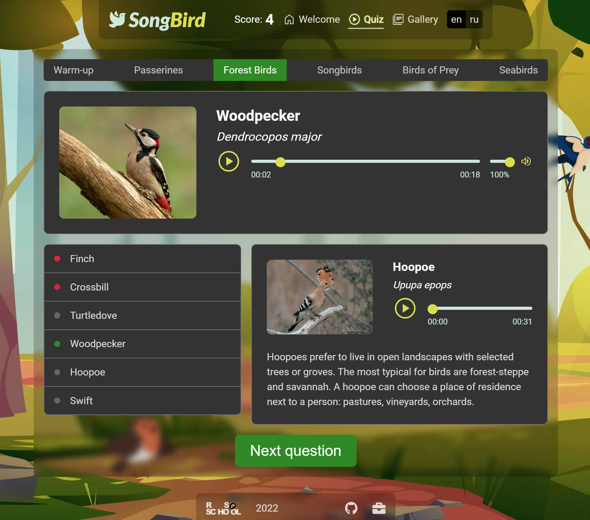

# Songbird Quiz

**_SongBird_** is a fun and engaging quiz app that challenges your ability to recognize common bird songs. It offers a unique and enjoyable way to learn about birds while testing your knowledge.

## Features

- **Quiz Mode**: Play the game by guessing bird names based on how they sound. You can see your score as the game progresses.
- **Gallery Mode**: Browse the gallery with bird songs and descriptions. You can learn about different bird species and their distinctive songs.
- **Multi-language Support**: The app supports English and Russian languages.
- **Custom Audio Player**: The app features a custom audio player that lets you play and pause bird songs.

## Tech stack

The app is built using the following technologies:

- **JavaScript ES6+**: The game is written in modern JavaScript that offers better readability, syntax, and performance.
- **Sass**: The app uses Sass, a powerful CSS preprocessor, that enables you to write maintainable and scalable CSS code.
- **Webpack**: The app uses Webpack, a popular bundler, that compiles JavaScript modules, CSS stylesheets, and other assets into a single bundle for deployment.

## Installation

To install and run the app on your local machine, follow these steps:

1. Clone the repository or download the source code.
2. Install the dependencies using `npm install`.
3. Start the development server using `npm start`.
